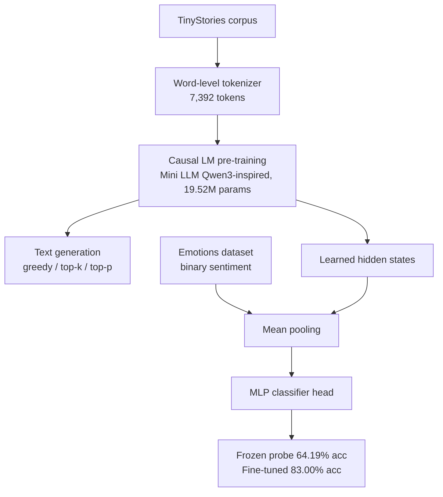
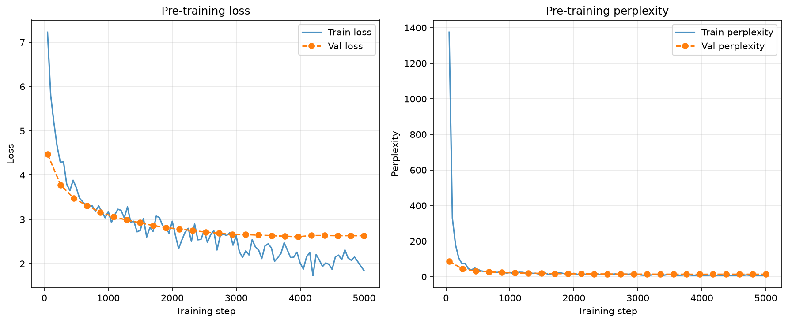
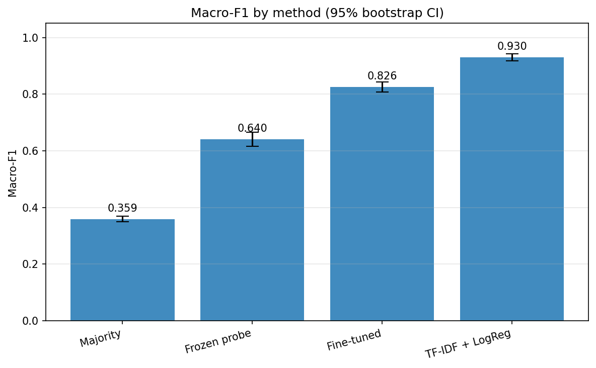
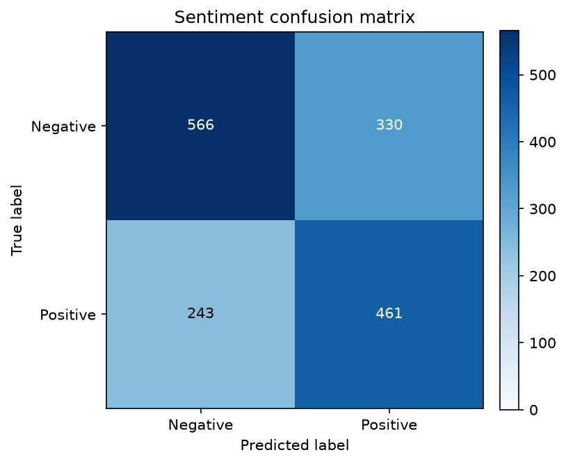
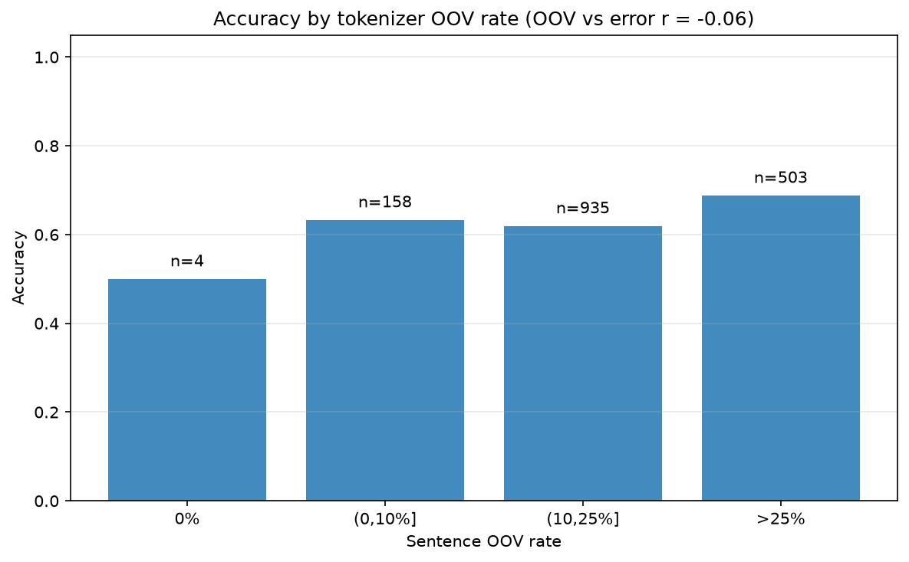

# From-Scratch Mini LLM: Pre-training and Sentiment Transfer

A compact, from-scratch decoder-only language model inspired by the Qwen3 family,
pre-trained on TinyStories and then reused for a downstream sentiment task. The
model borrows Qwen3-family design choices (RMSNorm, RoPE, SwiGLU, and grouped-query
capable attention) at roughly 19.5M parameters; it is a small model built to run on
CPU, not a reproduction of Qwen at scale. Every component (model, tokenizer,
training loop, generation, and the classifier head) is written directly in PyTorch
with no pre-trained weights. The sentiment task is run two ways, as a frozen-feature
probe and with the base fine-tuned, and both are reported against a majority-class
floor and a TF-IDF plus logistic-regression baseline.

**License:** [MIT](LICENSE)

## Results

Metrics are reconciled to the committed JSON under `artifacts/`, which is the single
source of truth. Pre-training uses the first 10,000 TinyStories (8,000 / 1,000 / 1,000
split, seed 42). The sentiment task uses 16,000 emotion-labeled sentences (7,238
positive, 8,762 negative), split 80/10/10 with seed 42, giving a 1,600-sentence test
set.

Pre-training:

| Metric | Value |
| --- | --- |
| Vocabulary coverage (training corpus) | 99.84% |
| Total steps | 5,000 (5 epochs) |
| Final train loss / perplexity | 1.84 / 6.31 |
| Final validation loss / perplexity | 2.63 / 13.90 |
| Best validation loss | 2.61 |

Frozen-probe sentiment (test set, 95% percentile-bootstrap CIs over 1,000 resamples):

| Metric | Value | 95% CI |
| --- | --- | --- |
| Test accuracy | 64.19% | 61.81 - 66.63 |
| Macro-F1 | 64.03% | 61.64 - 66.55 |
| Negative precision / recall / F1 | 69.96% / 63.17% / 66.39% | F1 63.84 - 68.95 |
| Positive precision / recall / F1 | 58.28% / 65.48% / 61.67% | F1 58.73 - 64.78 |
| Best validation macro-F1 | 66.69% | |

Method comparison on the shared test split:

| Method | Accuracy | Macro-F1 |
| --- | --- | --- |
| Majority class | 56.00% | 35.90% |
| Frozen probe (ours) | 64.19% | 64.03% |
| Fine-tuned base (ours) | 83.00% | 82.56% |
| TF-IDF + logistic regression | 93.19% | 93.04% |

The frozen probe clears the majority floor with non-overlapping confidence intervals,
so the pre-trained features carry real sentiment signal. Fine-tuning the base lifts
accuracy from 64.19% to 83.00% (macro-F1 64.03% to 82.56%), closing most of the
distance to the lexical baseline: adaptation, not raw feature quality, is the dominant
lever. The tokenizer was fit on TinyStories, so it covers only 79.58% of sentiment
tokens (20.42% OOV), but per-sentence OOV does not predict misclassification
(correlation -0.06), so vocabulary coverage is not the binding constraint at the
sentence level. The confidence intervals reflect test-set sampling for a single
trained model, not retraining or seed variance.

## Pipeline



Design choices:

- The tokenizer is word-level and fit on the training split only, so held-out text
  never influences the vocabulary. It is sized to 7,392 tokens for 99.84% coverage of
  the training corpus.
- Pre-training uses AdamW with `beta2 = 0.95` (the Qwen setting, which is more stable
  than the usual 0.999 on short sequences), gradient clipping, and a cosine
  learning-rate schedule with linear warmup.
- The headline sentiment result freezes the base and trains only a small MLP head over
  mean-pooled hidden states, which isolates how much sentiment signal pre-training
  captured. The `--finetune` path unfreezes the base for comparison.
- Baselines (majority class, TF-IDF plus logistic regression) and the OOV analysis
  share the exact test split, so every comparison is like-for-like.
- A fixed seed (42) governs splitting, shuffling, and initialization. Each stage writes
  committed JSON artifacts that later figure regeneration consumes.
- Generation uses a key-value cache that offsets rotary positions by the cached length,
  so incremental decoding matches a full forward pass token for token.

## Key figures






All pipeline and report figures are PNG, committed under `figures/`, and regenerable
from the committed artifacts with `--figures-only`.

## Quick start

**Requirements:** Python 3.10+ (tested on 3.13). The full pipeline runs on CPU; a
complete pre-training plus sentiment run takes on the order of an hour, so headline
metrics come from the committed artifacts rather than a required rerun.

```bash
git clone https://github.com/rhines7/from-scratch-mini-llm.git
cd from-scratch-mini-llm
pip install -r requirements.txt
```

**1. Set up data.** Follow [`data/README.md`](data/README.md) for both corpora, the
exact split sizes, and this verification:

```bash
python -c "import csv; rows=list(csv.DictReader(open('data/emotions_classified.csv', encoding='utf-8'))); print(len(rows), 'rows;', sum(r['sentiment']=='positive' for r in rows), 'positive')"
```

**2. Run the pipeline.** The entry script and package keep the `qwen3` name after the
Qwen3-inspired architecture, so the command is:

```bash
# Full pipeline (reproduces the reported results; long-running on CPU)
python qwen3_pipeline.py

# Fast smoke test on a tiny model and data subset
python qwen3_pipeline.py --quick

# Rebuild committed figures from committed artifacts (no training)
python qwen3_pipeline.py --figures-only
```

Individual phases and utilities:

| Command | Effect |
| --- | --- |
| `--phase N` | Run only phase N (1 architecture, 2 data, 3 pre-training, 4 generation, 5 sentiment) |
| `--through N` | Run phases 1 through N in order |
| `--skip-prep` | Skip data preparation in the full run |
| `--skip-pretrain` | Skip pre-training in the full run |
| `--skip-generate` | Skip generation in the full run |
| `--resume PATH` | Resume pre-training from a checkpoint |
| `--interactive` | Launch the interactive generation REPL |
| `--eval-only` | Evaluate the trained sentiment classifier on the test set |
| `--baseline` | Compute majority-class and TF-IDF baselines plus the tokenizer OOV rate |
| `--finetune` | Train the sentiment classifier with the base model unfrozen |

To reproduce every committed artifact and figure, run the full pipeline, then
`--baseline`, then `--finetune`, then `--figures-only`. Run the tests with
`python -m pytest -q`. `--quick` is only for verifying that the code runs end to end
and never overwrites committed artifacts.

**3. Read the report.** The written analysis is in [`docs/report.pdf`](docs/report.pdf)
(compiled from [`docs/report.tex`](docs/report.tex)).

## Project structure

```
qwen3_pipeline.py        Thin entry script (CLI + public API re-export)
qwen3/                   Implementation package
  __init__.py
  config.py
  architecture.py
  tokenizer.py
  data.py
  pretrain.py
  generate.py
  downstream.py
  baselines.py
  artifacts.py
  viz.py
  pipeline.py
qwen3_pipeline.ipynb     Guided phase tour
tests/                   Unit and smoke tests (pytest)
artifacts/               Committed summary metrics (JSON)
figures/                 Committed figures (PNG)
data/                    Data instructions (raw corpora are not committed)
docs/                    Written report (report.tex, report.pdf)
requirements.txt         Dependencies
```

| Path | Description |
| --- | --- |
| `qwen3_pipeline.py` | Thin entry point; re-exports the package API and calls `main()` |
| `qwen3/config.py` | Canonical paths, seeds, and shared constants |
| `qwen3/architecture.py` | The from-scratch model (RMSNorm, RoPE, SwiGLU, attention) |
| `qwen3/tokenizer.py` | Word-level tokenizer with corpus-coverage analysis |
| `qwen3/data.py` | TinyStories loading, splitting, and DataLoaders |
| `qwen3/pretrain.py` | Causal-LM training loop and checkpoint I/O |
| `qwen3/generate.py` | Sampling strategies and the interactive REPL |
| `qwen3/downstream.py` | Sentiment dataset, MLP head, training/eval, bootstrap CIs |
| `qwen3/baselines.py` | Majority-class and TF-IDF baselines, OOV analysis |
| `qwen3/artifacts.py` | Writers for the committed summary artifacts |
| `qwen3/viz.py` | PNG figure generation |
| `qwen3/pipeline.py` | Stage orchestration and argument parsing |
| `tests/` | Unit and smoke tests |
| `artifacts/` | Committed JSON metric summaries backing the results tables |
| `figures/` | Committed PNG figures |

## Tech stack

Python · PyTorch · NumPy · scikit-learn · Matplotlib · Hugging Face Datasets

## Limitations

- The frozen probe is modest in absolute terms (64% accuracy) and well below the
  TF-IDF baseline (93%). It is a probe of representations, not a tuned classifier.
- Fine-tuning recovers most of the gap (83%), so the largest lever is adapting the
  base rather than improving the frozen features.
- The reported confidence intervals reflect test-set sampling only; seed and training
  variance would require multiple training runs, which were not done.
- The word-level tokenizer has a 20.42% OOV rate on the sentiment domain. A subword
  (BPE) tokenizer would reduce it, though the error analysis suggests that alone would
  not close the frozen-probe gap. Further scaling (larger model and corpus on GPU) and
  seed-variance intervals are the natural next steps.

## Author

Robert Hines (2026)
